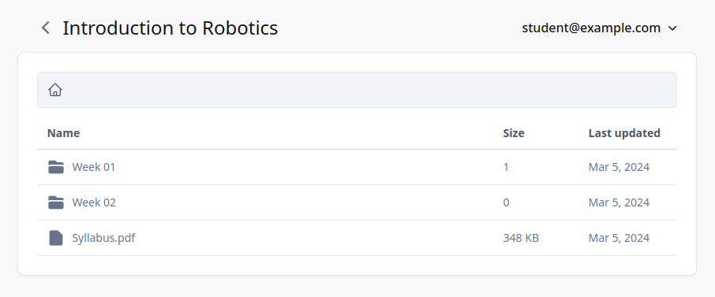
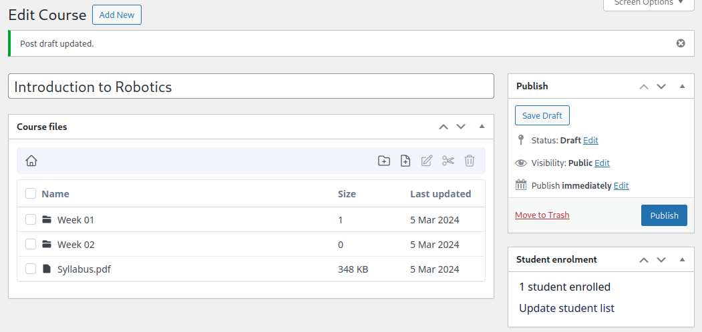

# Course resources
WordPress plugin to manage student access to course materials.





## Features
- Admin interface to upload files and organize them into folders
- Specify enrolled students email addresses to manage access permissions
- Student login portal with one time verification codes sent via email
- File previews for text, image and pdf files

## Requirements
- WordPress > 6.0
- ability to send emails via `wp_mail()`
- read and write permissions to the `wp-content/uploads` folder

## Instalation
- Download the plugin archive from the latest release file
- Add the `[course_resources]` shortcode to the page you want to display the student portal
- Start managing course files and student access

## How does the authentication work

The student accounts are not WordPress accounts and do not have permissions to access any data from the WordPress admin interface.

The authentication processs uses encrypted _JWT Tokens_, which is the standard way to make authenticated requests for single page applications.

The login flow involves the student entering his or her email address and receiving an email with a single use verification code to complete the authentication process.

## Development

This project uses [wp-env](https://developer.wordpress.org/block-editor/reference-guides/packages/packages-env/) to create a WordPress development environment inside a Docker container.

### Start environment
To start the container with XDebug support:

```
$ npm run wp-env start -- --xdebug
```

### Start webpack development build
```
$ npm run start
```

### Generate translation strings
```
$ npm run i18n:pot
```

### Production build
```
$ npm run i18n:mo
$ npm run i18n:json
$ npm run dist
```
